# Classic StoryMap Converter - Logic Flow Diagrams

This document contains visual flowcharts showing the conversion logic for all three classic StoryMap types.

---

## High-Level Conversion Flow

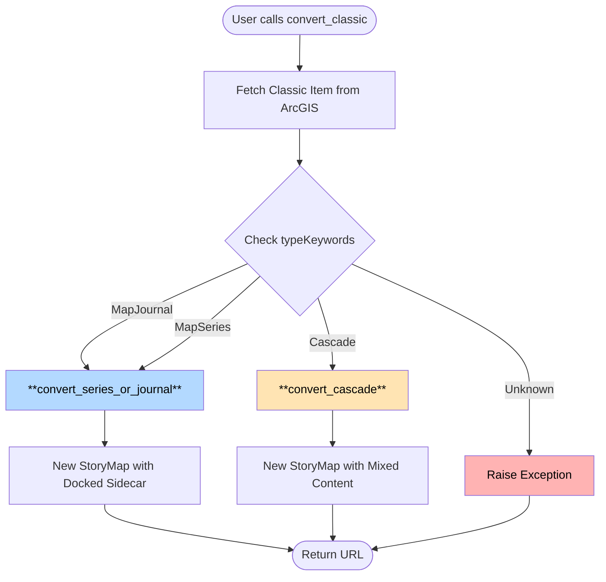

---

## Journal/Series Conversion Flow (Updated)

```mermaid
flowchart TD
    Start([convert_series_or_journal]) --> Init[Initialize tracking dicts:<br/>map_setting_dict, embed_settings_dict, local_images]

    Init --> CreateStory[Create new empty StoryMap]
    CreateStory --> AddSidecar[Add empty docked-panel sidecar]

    AddSidecar --> FetchData[Fetch classic story data]
    FetchData --> GetSections{Story Type?}

    GetSections -->|Journal| JSections[Get values.story.sections]
    GetSections -->|Series| SSections[Get values.story.entries]

    JSections --> LoopStart[For each section]
    SSections --> LoopStart

    LoopStart --> MediaType{Media Type?}

    MediaType -->|webmap| ProcessMap[Process WebMap:<br/>- Get map ID, extent, layers<br/>- Calculate scale<br/>- Store settings in map_setting_dict]
    MediaType -->|image| ProcessImage[Process Image:<br/>- Download if AGO resource<br/>- Track local images]
    MediaType -->|video/webpage| ProcessEmbed[Process Embed:<br/>- Convert to embed type<br/>- Store embedlyType in embed_settings_dict]

    ProcessMap --> ParseContent[Parse HTML content with BeautifulSoup]
    ProcessImage --> ParseContent
    ProcessEmbed --> ParseContent

    ParseContent --> ExtractElements[Extract elements:<br/>- Title → Heading text<br/>- Images → Image nodes<br/>- Paragraphs → Text nodes<br/>- iframes → Embed nodes]

    ExtractElements --> AddSlide[Add slide to sidecar:<br/>media + narrative content]

    AddSlide --> MoreSections{More sections?}
    MoreSections -->|Yes| LoopStart
    MoreSections -->|No| FirstSave[Save story]

    FirstSave --> PostProcessMaps[Post-process Maps:<br/>For each map in map_setting_dict]

    PostProcessMaps --> ReloadStory[Reload story for map]
    ReloadStory --> GetLayers[Fetch map layers from WebMap]
    GetLayers --> SetViewpoint[Set viewpoint, extent, scale]
    SetViewpoint --> SetVisibility[Apply layer visibility]
    SetVisibility --> SaveMap[Save story]
    SaveMap --> MoreMaps{More maps?}

    MoreMaps -->|Yes| PostProcessMaps
    MoreMaps -->|No| CleanResources[Clean up resources:<br/>- Set webmap type to minimal<br/>- Remove redundant properties<br/>- Set theme]

    CleanResources --> FixEmbeds[Fix embed settings:<br/>- Set embedType<br/>- Set display mode]

    FixEmbeds --> Cleanup[Final cleanup:<br/>- Delete local images<br/>- Remove empty slides<br/>- Set title and cover]

    Cleanup --> FinalSave[Final save with tracking keyword]
    FinalSave --> PersistLocal[Persist local drafts:<br/>- tmp-converted/draft.json<br/>- entry-<n>.json<br/>- collection-draft.json]
    PersistLocal --> CreateCollection[Create Collection (AGSM schema):<br/>- cover/nav/ui/root nodes<br/>- story-theme resource]
    CreateCollection --> DetectThemeLayout[Detect theme + layout from classic settings]
    DetectThemeLayout --> SetCollectionThumb[Set collection thumbnail from classic item]
    SetCollectionThumb --> FinishPublishing[Surface Finish Publishing button + URL]
    FinishPublishing --> Done([Return URL])

    style ProcessMap fill:#a8e6a8,color:#000000
    style ProcessImage fill:#ffb3b3,color:#000000
    style ProcessEmbed fill:#b3ccff,color:#000000
    style PostProcessMaps fill:#fff0a8,color:#000000
    style FinalSave fill:#a8e6a8,color:#000000
```

---

## Journal/Series: Section Content Parsing

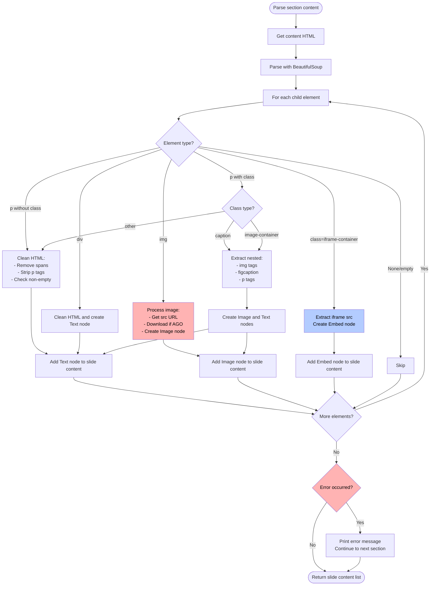

---

## Cascade Conversion Flow

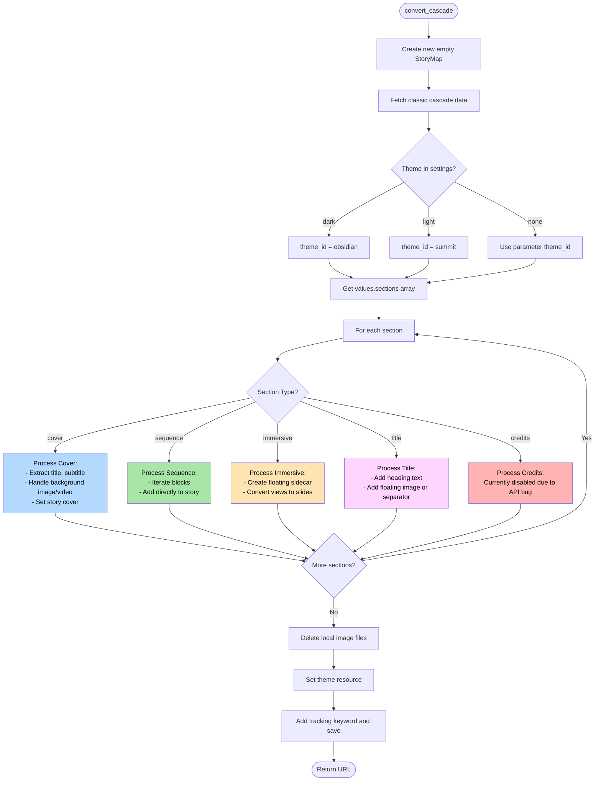

---

## Cascade: Immersive Section Processing

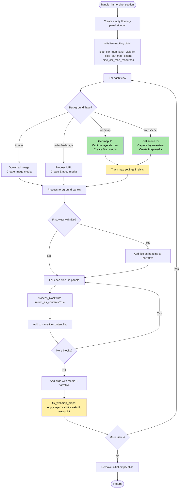

---

## Cascade: Block Processing Dispatcher

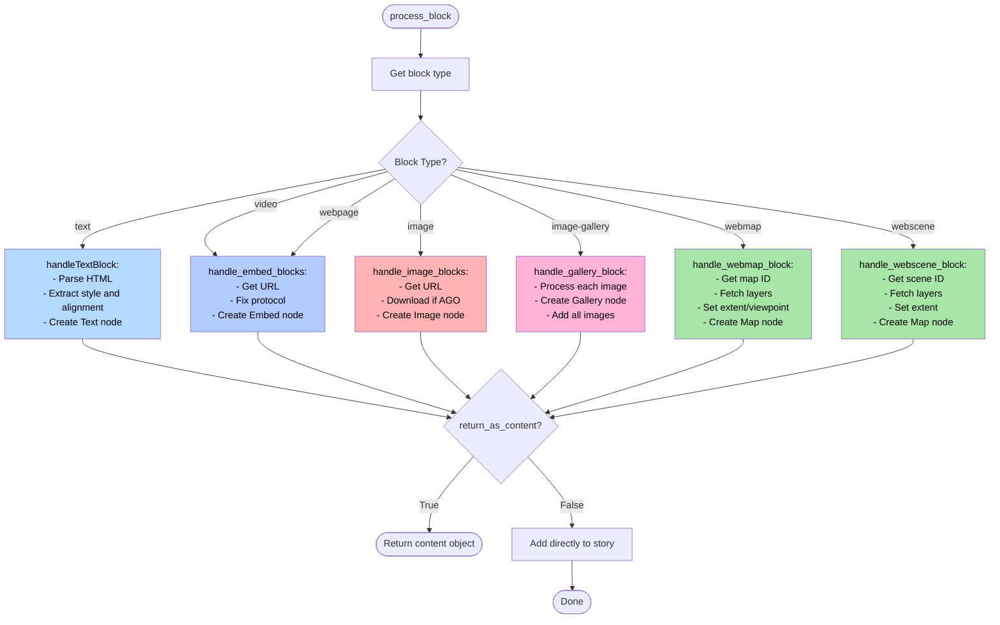

---

## Cascade: Text Block Processing

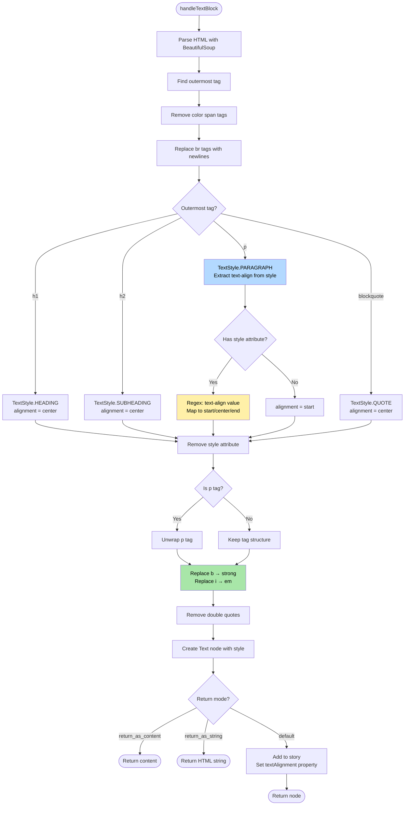

---

## Cascade: WebMap Block Processing

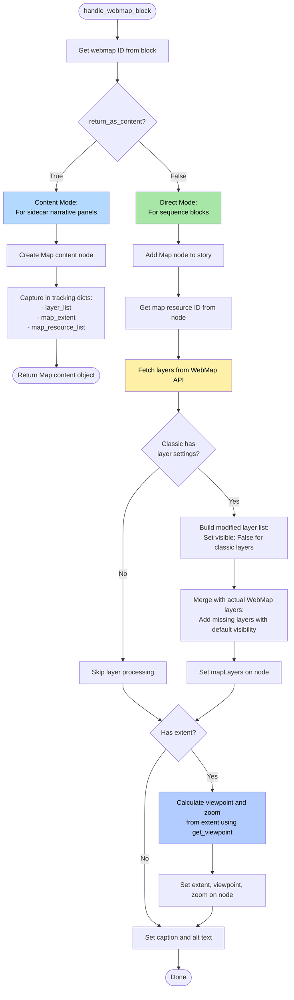

---

## Cascade: WebScene Block Processing

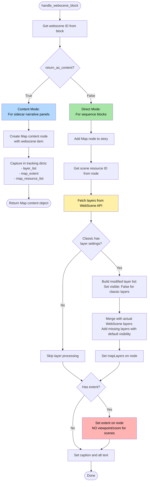

---

## Cascade: Gallery Block Processing

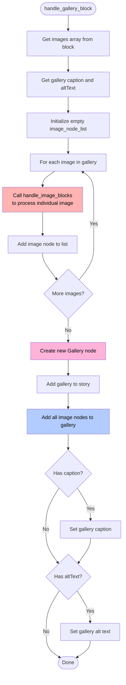

---

## Cascade: Embed Block Processing

```mermaid
flowchart TD
    Start([handle_embed_blocks]) --> CheckMode{return_as_content?}

    CheckMode -->|True| ContentMode[Content Mode:<br/>For sidecar narrative panels]
    CheckMode -->|False| DirectMode[Direct Mode:<br/>For sequence blocks]

    ContentMode --> GetTypeC[Get embed type:<br/>video or webpage]
    DirectMode --> GetTypeD[Get embed type:<br/>video or webpage]

    GetTypeC --> GetURLc[Get URL from block\[embed_type\]\['url'\]]
    GetTypeD --> GetURLd[Get URL from block\[embed_type\]\['url'\]]

    GetURLc --> FixProtocolC[Fix URL Protocol]
    GetURLd --> FixProtocolD[Fix URL Protocol]

    FixProtocolC --> CheckHTTPS1{Starts with<br/>https://?}
    FixProtocolD --> CheckHTTPS2{Starts with<br/>https://?}

    CheckHTTPS1 -->|No| AddHTTPS1[Prepend https://]
    CheckHTTPS1 -->|Yes| CheckSlash1{Starts with //?}
    AddHTTPS1 --> CheckSlash1

    CheckSlash1 -->|Yes| PrependProto1[Replace // with https://]
    CheckSlash1 -->|No| CheckValid1{Valid https://?}
    PrependProto1 --> CheckValid1

    CheckValid1 -->|No| Fallback1[Set to https://example.com/]
    CheckValid1 -->|Yes| CreateContentEmbed[Create Embed content node]
    Fallback1 --> CreateContentEmbed

    CreateContentEmbed --> ReturnContent([Return Embed content])

    CheckHTTPS2 -->|No| AddHTTPS2[Prepend https://]
    CheckHTTPS2 -->|Yes| CheckSlash2{Starts with //?}
    AddHTTPS2 --> CheckSlash2

    CheckSlash2 -->|Yes| PrependProto2[Replace // with https://]
    CheckSlash2 -->|No| CheckValid2{Valid https://?}
    PrependProto2 --> CheckValid2

    CheckValid2 -->|No| Fallback2[Set to https://example.com/]
    CheckValid2 -->|Yes| AddEmbed[Add Embed node to story]
    Fallback2 --> AddEmbed

    AddEmbed --> GetNode[Get embed node reference]
    GetNode --> HasCaption{Has caption?}

    HasCaption -->|Yes| SetCaption[Set embed.caption]
    HasCaption -->|No| HasAlt{Has altText?}

    SetCaption --> HasAlt
    HasAlt -->|Yes| SetAlt[Set embed.alt_text]
    HasAlt -->|No| Done([Done])

    SetAlt --> Done

    style ContentMode fill:#b3d9ff,color:#000000
    style DirectMode fill:#a8e6a8,color:#000000
    style FixProtocolC fill:#fff0a8,color:#000000
    style FixProtocolD fill:#fff0a8,color:#000000
    style Fallback1 fill:#ffb3b3,color:#000000
    style Fallback2 fill:#ffb3b3,color:#000000
```

**Note:** Both video and webpage blocks are converted to Embed nodes. The embed type is stored separately in post-processing (embedlyType: 'video' or 'link') and display mode (inline or card).

---

## Utility: Image Processing

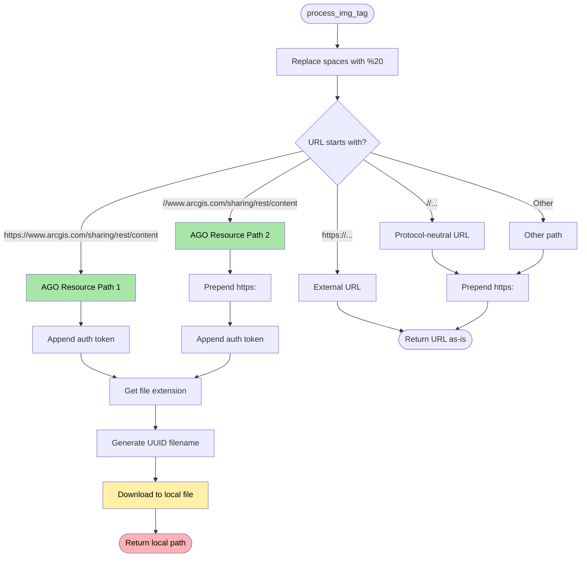

---

## Utility: Sidecar Creation

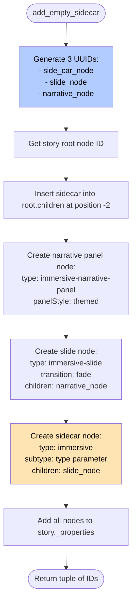

---

## Post-Processing: Map Settings

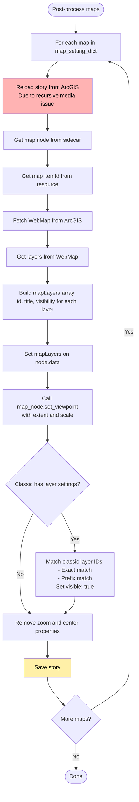

---

## Key Decision Points

### Type Detection

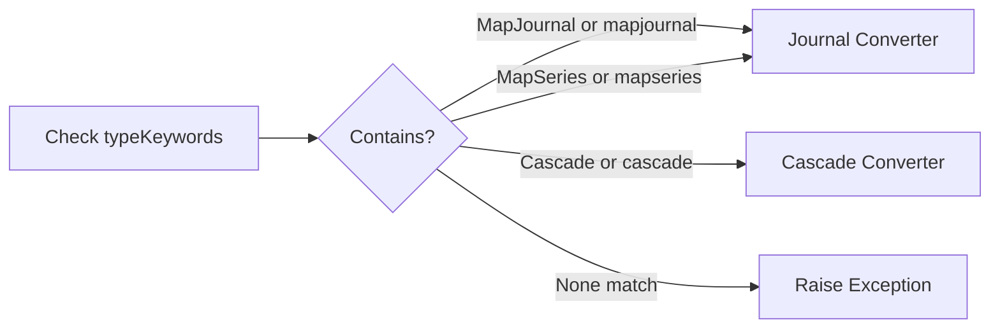

### Media Type Handling

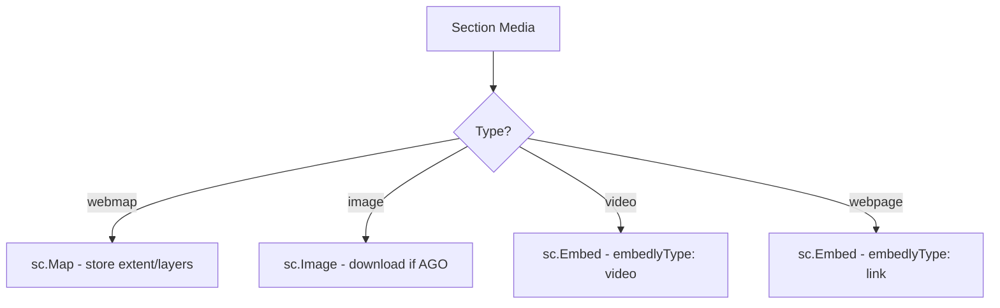

### Content Mode

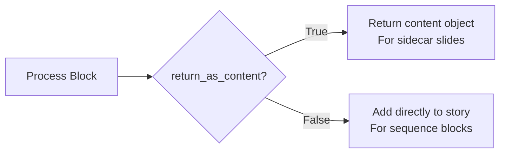

---

## Data Transformation Flow

```mermaid
flowchart LR
    A[Classic JSON] --> B[BeautifulSoup Parser]
    B --> C[Extract Structure]
    C --> D[Content Nodes]
    D --> E[StoryMap Properties]
    E --> F[Post-Process]
    F --> G[Final JSON]
    G --> H[Save to ArcGIS]

    style A fill:#b3d9ff,color:#000000
    style C fill:#a8e6a8,color:#000000
    style E fill:#ffe4b3,color:#000000
    style G fill:#a8e6a8,color:#000000
    style H fill:#ffb3b3,color:#000000
```

---

These diagrams illustrate the complete conversion logic flow for all three classic StoryMap types and show the key decision points, data transformations, and processing steps involved in the conversion process.
