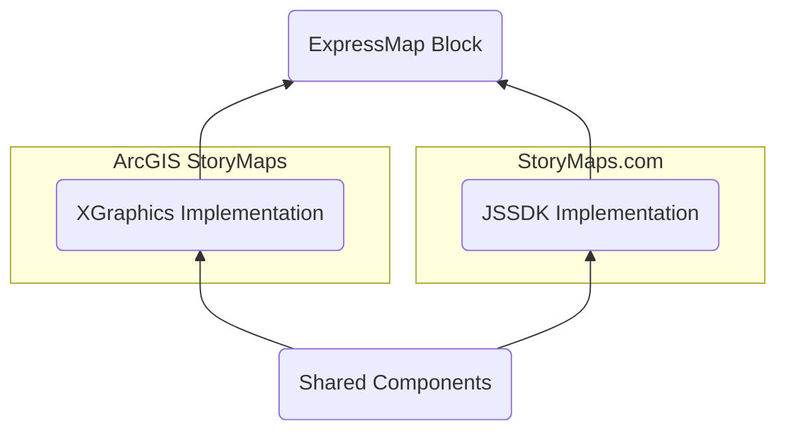

# Maps in Storymaps

Here is a [story](https://storymaps.com/stories/60e5c9820aba49069f99e1d41c0a72ff) showcasing all kinds of the maps offered by the products.

## Map Block

Availability and implementation:

| Block                      | ArcGIS StoryMaps  | StoryMaps.com      |
| -------------------------- | ----------------- | ------------------ |
| Express Map                | XGraphics\* impl. | JSSDK† impl.       |
| Web Map / Ready-to-use Map | "Web Map”         | "Ready-to-use Map" |
| Thematic Map               | -                 | JSSDK impl.        |
| Tour Map                   | JSSDK impl.       | JSSDK impl.        |

- \* **XGraphics:** `storymaps-xgraphics`
- † **JSSDK:** ArcGIS Maps SDK for JavaScript. Previously known as ArcGIS API for JavaScript, or JSAPI. ([JSSDK Resources](../misc/arcgis-js-api-resources.md))

Just like any other types of block, there are two required components, `Builder` and `Viewer`. For map blocks, there are some components following the naming convention:

- `Editor` component: the editing experience rendered in a modal
- `Displayer` component: the viewing experience rendered in both `Builder` and `Viewer`

Each map block makes use of the `CoreMap` component to load the JSSDK map (if needed, also XGraphics), typically in the `Displayer` or `Editor` components. The only exception is Web Map / Ready-to-use Map, which uses `ArcGISMapBase` instead.

Stored in the `map-shared` folder are components, utilities, types, etc., that are shared amongst the map blocks and areas that may need them (eg. the `BasemapPicker` in theme builder).

### Express Map

> Known as "EM" or "XM". [Live demo](https://storymaps.com/stories/60e5c9820aba49069f99e1d41c0a72ff#ref-n-DplVkT)

An author can use **Express Map Editor** (`Editor` component under `expressmap` folder) to create/edit this block.

There are two implementations:

- XGraphics Implementation: `DisplayerX`, `EditorX`
- JSSDK Implementation: `Displayer`, `Editor`

#### Lab features

- Import data for visualization (AGSM): See [#12463](https://devtopia.esri.com/WebGIS/arcgis-storymaps/pull/12463)

### Web Map

> Known as "WM". [Live demo](https://storymaps.com/stories/60e5c9820aba49069f99e1d41c0a72ff#ref-n-PzHB8z)

An author can use **Map Browser** (`MapBrowser` component) to pick an existing AGOL portal item ([WebMap item](https://doc.arcgis.com/en/arcgis-online/reference/what-is-web-map.htm) or [WebScene item](https://doc.arcgis.com/en/arcgis-online/reference/what-is-web-scene.htm)), then use **Web Map Editor** (`Editor` component under `webmap` folder) to edit it.

> Note: even though the block is called "Web Map," it also allows a author to use a WebScene portal item.

### Thematic Map

> [Live demo](https://storymaps.com/stories/60e5c9820aba49069f99e1d41c0a72ff#ref-n-QEWKw9)

An author can **Map Selector** (`MapSelector` component) to select a "place" and then use **Thematic Map Editor** (`Editor` component under `thematic-map` folder) to edit it.

### Tour Map Block

A map block dedicated for **Map Tour** block (see below).

## Map Block Used in Other Blocks

### In Map Tour Block

> [Live demo](https://storymaps.com/stories/60e5c9820aba49069f99e1d41c0a72ff#ref-n-f0DTmZ)

After this block is inserted, an author can use **Location Editor** (`LocationEditor` component) to add/edit/delete a "location" and then use **Global Editor** (`GlobalEditor` component) to update settings for the block.

> Note: This **Map Tour** block uses a **Tour Map** block.

### In Sidecar/Slideshow Block

> [Live demo](https://storymaps.com/stories/60e5c9820aba49069f99e1d41c0a72ff#ref-n-DxJECr)

An Express Map / Web Map can be inserted as media in the **Media Panel**, which allows **Map Action**.

### In Swipe Block

> [Live demo](https://storymaps.com/stories/60e5c9820aba49069f99e1d41c0a72ff#ref-n-xGmOmE)

An Express Map / Web Map can be inserted (same type).

---

TODO: add Activity Map once it's fully implemented

---

[StoryMaps Documentation (Home)](../../README.md)
