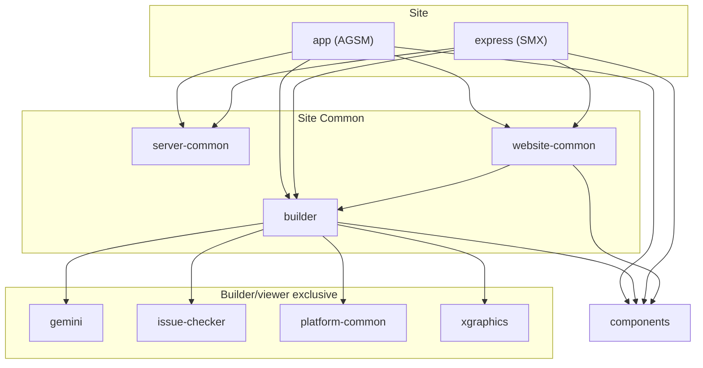
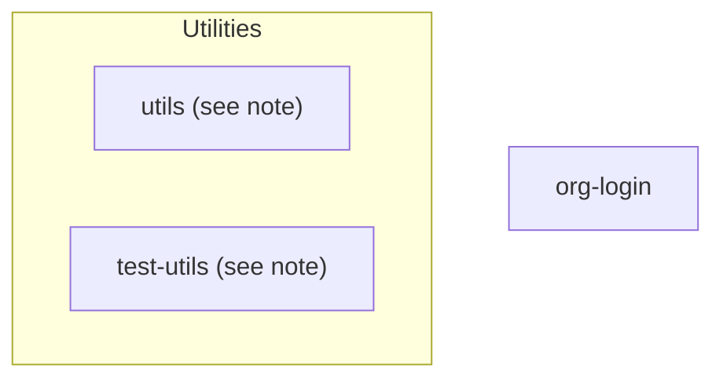

# StoryMaps Monorepo Structure

This app uses [Turborepo](https://turbo.build/) and [yarn workspaces](https://yarnpkg.com/) to manage the StoryMaps client, server, and shared components as a single repository. See [Getting Started](https://devtopia.esri.com/WebGIS/arcgis-storymaps/blob/ri12888/yarn-upgrade/docs/setup/getting-started.md#L38) for info on running `dev`, `test`, and other common workspace commands.

This repository includes the following packages:

## Shared Config (located in: `config/packages/`)

- [`eslint-config-storymaps`](/config/packages/eslint-config-storymaps/README.md): shared configuration for ESLint and Prettier
- [`shared-config`](/config/packages/shared-config/README.md): shared configuration for tests, storybook, build configurations, etc.

## App Packages (located in: `packages/`)

- [`storymaps-app`](/packages/storymaps-app/README.md): ArcGIS StoryMaps (AGSM)
- [`storymaps-builder`](/packages/storymaps-builder/README.md): StoryMaps Builder components, story block and group components
- [`storymaps-components`](/packages/storymaps-components/README.md): shared UI components
- [`storymaps-express`](/packages/storymaps-express/README.md): StoryMaps Express ("SMX"), a standalone, mobile-first app that targets a broader storytelling audience
- [`storymaps-gemini`](/packages/storymaps-gemini/README.md): StoryMaps Builder core framework
- [`storymaps-issue-checker`](/packages/storymaps-issue-checker/README.md): StoryMaps Issue Checker core framework. Checks story content for sharing issues etc. before publication. Utilities only, no UI.
- [`storymaps-org-login`](/packages/storymaps-org-login/README.md): ArcGIS Online hosted that redirects to org-specific login page for AGSM
- [`storymaps-server-common`](/packages/storymaps-server-common/README.md): Core server utilities and API handlers shared between AGSM and SMX websites. This is shared top-down with an understanding that both websites use NextJS
- [`storymaps-utils`](/packages/storymaps-utils/README.md): core utilities for StoryMaps. Should have no dependencies on other monorepo packages
- [`storymaps-website-common`](/packages/storymaps-website-common/README.md): Core components, static files, utilities shared between AGSM and SMX websites. This is shared top-down with an understanding that both websites use NextJS
- [`storymaps-platform-common`](/packages/storymaps-website-common/README.md): Core utilities shared between the frontend and [backend APIs](https://devtopia.esri.com/WebGIS/storymaps-api).
- [`storymaps-xgraphics`](/packages/storymaps-xgraphics/README.md): custom graphics library (**XGraphics**)

## Shared Test Utilities (located in: `packages/`)

- [`test-utils`](/packages/test-utils/README.md): shared utilities for testing

## Team VSCode Extensions (located in: `extensions/`)

- [`strings-extension`](/extensions/strings-extension/README.md): An extension to simplify the management strings for i18n.

## Package Dependencies

Notes:

- Package names' common prefix `storymaps-` is omitted for brevity.
- `[storymaps-]utils` is depended by all other packages except `storymaps-xgraphics`, `storymaps-org-login`, and `test-utils`. Its dependency arrows are omitted for brevity
- `test-utils` is a non-runtime dependency. Its dependency arrows are omitted for brevity.

---

[StoryMaps Documentation (Home)](../../README.md)
