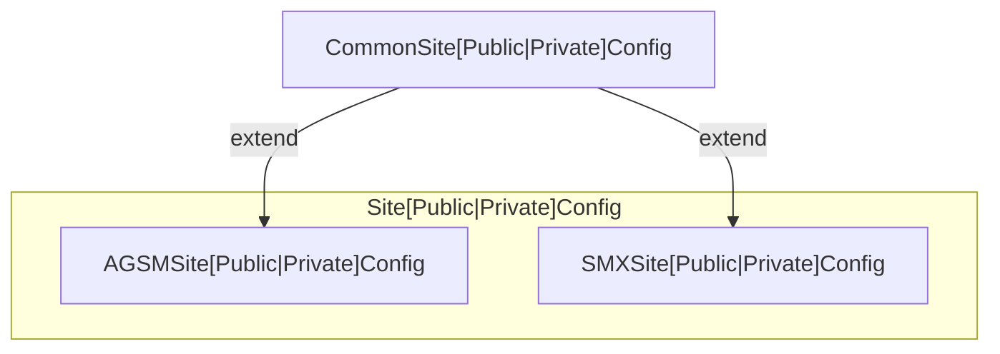

# Site Config

> [!TIP]
>
> Need to add a new config property? Check out [Dev Guides | Adding a property to the config](/docs/dev-guides/add-config-property.md).

Our application has a lot of root config properties that need to be accessed throughout the application life cycle.

## Public and Private Configs

We have a [SitePublicConfig](/packages/storymaps-utils/src/config/types/site-public.ts) and a [SitePrivateConfig](/packages/storymaps-utils/src/config/types/site-private.ts). The `SitePrivateConfig` contains app secrets used by the site servers and should **never** be sent to the front end. The server and its API endpoints still have access to the `SitePublicConfig`, so there's no reason for these two types to overlap.

If you have a new config property that should remain secret, make sure you put in `SitePrivateConfig` and never commit it to the repo.

### Product Specific Configs

The `SitePublicConfig` and `SitePrivateConfig` types are unions of `AGSMSitePublicConfig | SMXSitePublicConfig` and `SMXSitePrivateConfig | AGSMSitePrivateConfig`. These interfaces extend common interfaces (`CommonSitePublicConfig` and `CommonSitePrivateConfig`).



Since `SitePublicConfig` is a union of `AGSMSitePublicConfig` and `SMXSitePublicConfig`, you need to cast the config when you need to access site specific properties e.g.

```typescript
// casting useConfig result as SMXSitePublicConfig
const { BACKEND_API_SERVER_URL } = useConfig() as SMXSitePublicConfig;
```

## Generating Configs

> [!NOTE]  
> We used to have static `config.js` and `build-config.js` files that held the default values for config properties, but these caused some confusion because the build config's purpose was not clear.

Now we define objects with the same key as the old `config.js` files but the value are [ConfigPropertyInfo](/packages/storymaps-utils/src/config/propInfo/index.ts) objects.

```typescript
export interface ConfigPropertyInfo {
  defaultValue?: unknown;
  optional?: boolean;
  type: 'boolean' | 'object' | 'number' | 'string';
}

const configPropInfo: Record<keyof ConfigType, ConfigPropertyInfo> = {
  PROP_KEY: { defaultValue: 'test', type: 'string' },
};
```

We use these objects to access values in environment variables, set default values, check property types, and throw errors if a required value is not set.

The [getConfigFromPropInfo](/packages/storymaps-utils//src/config/updateWithEnv/index.ts) function loops through the entries in the records and builds the config.

### Site Config Props

- [AGSM](/packages/storymaps-app/server/src/config-props.ts)
- [SMX](/packages/storymaps-express/server/src/config-props.ts)

### Benefits

There was a lot of duplication across the old config files. We centralized the common config props in the `storymaps-utils` package, but give the individual sites the ability to overwrite them.

### When are the configs generated?

We generate the configs in the server files for the apps ([AGSM](/packages/storymaps-app/server/src/index.ts)/[SMX](/packages/storymaps-express/server/src/index.ts)) when container starts up. You can see that `getConfigFromPropInfo` is called with the props listed above for each site.

## How is the config passed around?

We append the config to all endpoints with the following `express` code:

```typescript
router.all('*', (req: RequestWithServerInjectedProps, res, nextFunc) => {
  // pass from server so we can change the source config.js & restart server without rebuilding the app
  req.config = config;

  nextFunc();
});
```

This allows all serverside next operations to access the config though `context.req.config`.

We append the server config to all SMX API routes (not handled in AWS) with the following:

```typescript
router.use('/api/*', (req, res, nextFunc) => {
  req['serverConfig'] = serverConfig;
  nextFunc();
});
```

and API handlers access the server config with `context.req.serverConfig`.

Note: the API handlers can also access the public config.

## Environment Variables

We override the config default values with environment variables. You can override any config value locally by adding a value in your `.env.local` file. In production, devops sets environment variables when they deploy the container in `AWS Fargate`.

### Setting environment variables from .env files

We set environment variables by calling [the root env script](/config/packages/shared-config/env/index.js), which the `process.env.NODE_ENV` values and uses the correct `.env` files. We use the [dotenv](https://www.npmjs.com/package/dotenv?activeTab=readme) to help us with this. It will start with what's already set in the environment and add values from each `.env` we tell it to use. By default, `dotenv` won't override a property that has already been set. So when devops sets environment variables, we won't override them, we need be careful about the order of these files.

### Static Builds

Any config value you want to override while building a static site can be set in the `.env.enterprise` file. You can commit these values and don't need to override in any other files.

## Moving forward

- Can we remove some config values? e.g. feature flags that may not be necessary
- Setting the basemap values involves an unnecessary mapping.
- Can we move values in the the common config?
