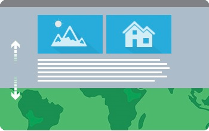

# Classic Apps List:

## Story Map Tour: https://github.com/Esri/storymap-tour

This app presents a sequential, place-based narrative in the form of a series of geotagged photos and captions linked to an interactive map. It’s ideal for walking tours or for a series of locations you’d like users to follow in sequence

## Story Map Journal: https://github.com/Esri/storymap-journal

This app lets you create a compelling map-based narrative presented as a set of journal entries. It's ideal for creating multimedia stories that combine text, maps, images, and video, especially when you have lots of text or a rich array of content.

## Story Map Series: https://github.com/Esri/storymap-series
### Tabbed

The Tabbed layout presents a series of maps via a set of tabs. There's an optional description panel for presenting text and other content associated with each map.

### Side-Accordion

The Side Accordion layout presents a series of maps, and accompanying text and other content for each map, in an expandable panel. Clicking a title selects the map and expands the panel to reveal the text.

### Bulleted

The Bulleted layout presents a series of maps via numbered bullets, one per map. It's a good choice when you have a large number of maps or locations to present. There's an optional description panel for presenting text and other content associated with each map.

## Story Map Swipe: https://github.com/Esri/storymap-swipe
### Swipe

The swipe tool displays either two separate web maps or two layers of a single web map. Users can slide the swipe tool back and forth to compare one map theme to a second, related theme.

### Spyglass

The Spyglass app is similar to Swipe but enables users to peer through one map to another by using a spyglass function. The app can display two layers of a single web map, or two separate web maps.

## Story Map Basic: https://github.com/Esri/storymap-basic

This app lets you present a map via a very simple minimalist user interface. Apart from the title bar and an optional legend, the map fills the screen. Use this app to let your map speak for itself.

## Story Map Shortlist: https://github.com/Esri/storymap-shortlist

This app lets you present a set of places organized into a set of tabs based on themes, for example, food, hotels, and attractions. As users navigate around the map, the tabs update to show them the places in the current map extent.

## Story Map Playlist: https://web.archive.org/web/20160219094115/https://github.com/Esri/playlist-storytelling-template-js

This app gives users options to explore locations using a map and by scanning a preview list displaying titles and thumbnail images.

## Story Map Countdown: https://web.archive.org/web/20160130012050/https://github.com/Esri/countdown-storytelling-template-js

This app presents a list of locations along with information about each location. The app taps a web map and its pop-ups; pop-up contents are shown in a side panel. Users can toggle the main map and a locator map back and forth.

## Story Map Crowdsource: https://github.com/Esri/storymap-crowdsource

This app enables you to publish and manage a crowdsourced story to which anyone can contribute photos with captions. Use it to engage a specific or general audience on the subject of your choice. To contribute to your story people can sign in with their Facebook, Google, or ArcGIS account, or use a guest option. A vetting function lets you review and approve contributions.

## Story Map Cascade: https://github.com/Esri/storymap-cascade

This app lets you combine narrative text with maps, images, and multimedia content in an engaging, full-screen scrolling experience. In a Cascade story, sections containing text and in-line media can be interspersed with "immersive" sections that fill the screen with your maps, 3D scenes, images, and videos. Cascade is ideal for making compelling, in-depth stories that are very easy for people to navigate.

## Story Map Custom (one-offs built for specific customers or unique ideas)

