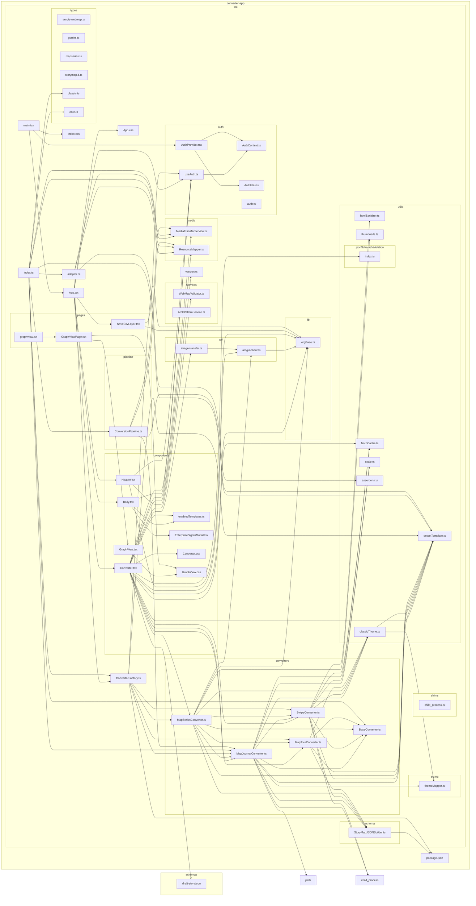

# Dependency Cruiser Output

```mermaid
flowchart LR

subgraph 0["converter-app"]
subgraph 1["src"]
2["App.tsx"]
3["App.css"]
subgraph 4["auth"]
5["useAuth.ts"]
6["AuthContext.ts"]
1I["AuthProvider.tsx"]
1J["AuthUtils.ts"]
1K["auth.ts"]
end
subgraph 7["components"]
8["Body.tsx"]
9["enabledTemplates.ts"]
A["EnterpriseSignInModal.tsx"]
B["Converter.tsx"]
E["Converter.css"]
1B["Header.tsx"]
1L["GraphView.tsx"]
1M["GraphView.css"]
end
subgraph F["api"]
G["arcgis-client.ts"]
J["image-transfer.ts"]
end
subgraph H["lib"]
I["orgBase.ts"]
end
subgraph K["converters"]
L["MapJournalConverter.ts"]
Y["BaseConverter.ts"]
Z["SwipeConverter.ts"]
11["MapSeriesConverter.ts"]
13["MapTourConverter.ts"]
end
subgraph O["schema"]
P["StoryMapJSONBuilder.ts"]
end
subgraph R["theme"]
S["themeMapper.ts"]
end
subgraph T["utils"]
U["classicTheme.ts"]
V["detectTemplate.ts"]
W["fetchCache.ts"]
X["scale.ts"]
10["htmlSanitizer.ts"]
12["thumbnails.ts"]
subgraph 19["jsonSchemaValidation"]
1A["index.ts"]
end
1H["assertions.ts"]
end
subgraph 14["media"]
15["MediaTransferService.ts"]
16["ResourceMapper.ts"]
end
subgraph 17["services"]
18["WebMapValidator.ts"]
1X["ArcGISItemService.ts"]
end
1C["version.ts"]
subgraph 1D["pages"]
1E["SaveCsvLayer.tsx"]
1V["GraphViewPage.tsx"]
1W["graphview.tsx"]
end
1F["ConverterFactory.ts"]
1G["adapter.ts"]
1N["index.ts"]
subgraph 1O["pipeline"]
1P["ConversionPipeline.ts"]
end
subgraph 1Q["types"]
1R["classic.ts"]
1S["core.ts"]
20["arcgis-webmap.ts"]
21["gemini.ts"]
22["mapseries.ts"]
23["storymap.d.ts"]
end
1T["main.tsx"]
1U["index.css"]
subgraph 1Y["shims"]
1Z["child_process.ts"]
end
end
Q["package.json"]
end
subgraph C["schemas"]
D["draft-story.json"]
end
M["child_process"]
N["path"]
2-->3
2-->5
2-->8
2-->B
2-->1B
2-->1E
5-->6
8-->5
8-->9
8-->A
B-->D
B-->G
B-->J
B-->5
B-->L
B-->11
B-->13
B-->Z
B-->I
B-->15
B-->16
B-->18
B-->V
B-->W
B-->1A
B-->E
B-->9
G-->I
J-->G
L-->P
L-->S
L-->U
L-->V
L-->W
L-->X
L-->Y
L-->Z
L-->M
L-->N
P-->Q
U-->S
U-->V
Z-->P
Z-->U
Z-->V
Z-->W
Z-->10
Z-->X
Z-->Y
Z-->M
11-->G
11-->I
11-->P
11-->U
11-->V
11-->12
11-->Y
11-->L
11-->13
11-->Z
13-->P
13-->U
13-->V
13-->Y
1B-->5
1B-->I
1B-->1C
1E-->5
1E-->I
1F-->Q
1F-->L
1F-->11
1F-->13
1F-->Z
1F-->I
1F-->V
1G-->1F
1G-->15
1G-->16
1G-->1H
1I-->6
1I-->1J
1L-->1M
1N-->1G
1N-->1F
1N-->Y
1N-->L
1N-->15
1N-->16
1N-->1P
1N-->1R
1N-->1S
1N-->V
1P-->L
1P-->15
1P-->16
1P-->V
1T-->2
1T-->1I
1T-->1U
1V-->1L
1V-->1M
1W-->1V
```
