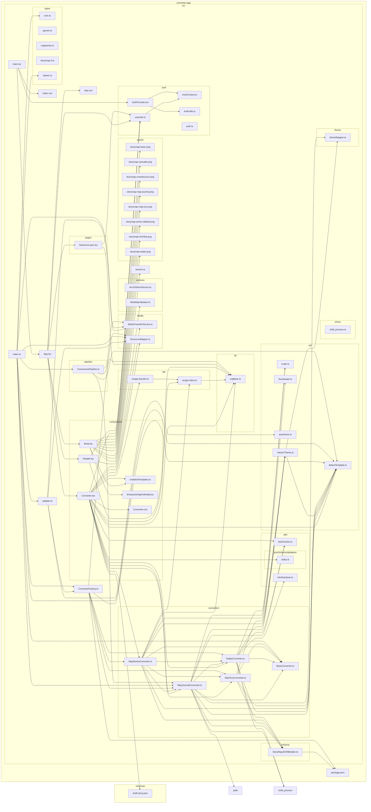

# Dependency Cruiser Output

```mermaid
flowchart LR

subgraph 0["converter-app"]
subgraph 1["src"]
2["App.tsx"]
3["App.css"]
subgraph 4["auth"]
5["useAuth.ts"]
6["AuthContext.ts"]
1S["AuthProvider.tsx"]
1T["AuthUtils.ts"]
1U["auth.ts"]
end
subgraph 7["components"]
8["Body.tsx"]
I["enabledTemplates.ts"]
J["EnterpriseSignInModal.tsx"]
K["Converter.tsx"]
N["Converter.css"]
1L["Header.tsx"]
end
subgraph 9["assets"]
A["storymap-basic.png"]
B["storymap-cascade.png"]
C["storymap-crowdsource.png"]
D["storymap-map-journal.png"]
E["storymap-map-tour.png"]
F["storymap-series-tabbed.png"]
G["storymap-shortlist.png"]
H["storymap-swipe.png"]
end
subgraph O["api"]
P["arcgis-client.ts"]
S["image-transfer.ts"]
end
subgraph Q["lib"]
R["orgBase.ts"]
end
subgraph T["converters"]
U["MapJournalConverter.ts"]
18["BaseConverter.ts"]
19["SwipeConverter.ts"]
1B["MapSeriesConverter.ts"]
1D["MapTourConverter.ts"]
end
subgraph X["schema"]
Y["StoryMapJSONBuilder.ts"]
end
subgraph 10["theme"]
11["themeMapper.ts"]
end
subgraph 12["util"]
13["classicTheme.ts"]
14["detectTemplate.ts"]
15["scale.ts"]
1C["thumbnails.ts"]
1R["assertions.ts"]
end
subgraph 16["utils"]
17["fetchCache.ts"]
1A["htmlSanitizer.ts"]
subgraph 1J["jsonSchemaValidation"]
1K["index.ts"]
end
end
subgraph 1E["media"]
1F["MediaTransferService.ts"]
1G["ResourceMapper.ts"]
end
subgraph 1H["services"]
1I["WebMapValidator.ts"]
23["ArcGISItemService.ts"]
end
1M["version.ts"]
subgraph 1N["pages"]
1O["SaveCsvLayer.tsx"]
end
1P["ConverterFactory.ts"]
1Q["adapter.ts"]
1V["index.ts"]
subgraph 1W["pipeline"]
1X["ConversionPipeline.ts"]
end
subgraph 1Y["types"]
1Z["classic.ts"]
20["core.ts"]
26["gemini.ts"]
27["mapseries.ts"]
28["storymap.d.ts"]
end
21["main.tsx"]
22["index.css"]
subgraph 24["shims"]
25["child_process.ts"]
end
end
Z["package.json"]
end
subgraph L["schemas"]
M["draft-story.json"]
end
V["child_process"]
W["path"]
2-->3
2-->5
2-->8
2-->K
2-->1L
2-->1O
5-->6
8-->A
8-->B
8-->C
8-->D
8-->E
8-->F
8-->G
8-->H
8-->5
8-->I
8-->J
K-->M
K-->P
K-->S
K-->5
K-->U
K-->1B
K-->1D
K-->19
K-->R
K-->1F
K-->1G
K-->1I
K-->14
K-->17
K-->1K
K-->N
K-->I
P-->R
S-->P
U-->Y
U-->11
U-->13
U-->14
U-->15
U-->17
U-->18
U-->19
U-->V
U-->W
Y-->Z
13-->11
13-->14
19-->Y
19-->13
19-->14
19-->15
19-->17
19-->1A
19-->18
19-->V
1B-->P
1B-->R
1B-->Y
1B-->13
1B-->14
1B-->1C
1B-->18
1B-->U
1B-->1D
1B-->19
1D-->Y
1D-->13
1D-->14
1D-->18
1L-->5
1L-->R
1L-->1M
1O-->5
1O-->R
1P-->Z
1P-->U
1P-->1B
1P-->1D
1P-->19
1P-->R
1P-->14
1Q-->1P
1Q-->1F
1Q-->1G
1Q-->1R
1S-->6
1S-->1T
1V-->1Q
1V-->1P
1V-->18
1V-->U
1V-->1F
1V-->1G
1V-->1X
1V-->1Z
1V-->20
1V-->14
1X-->U
1X-->1F
1X-->1G
1X-->14
21-->2
21-->1S
21-->22
```
